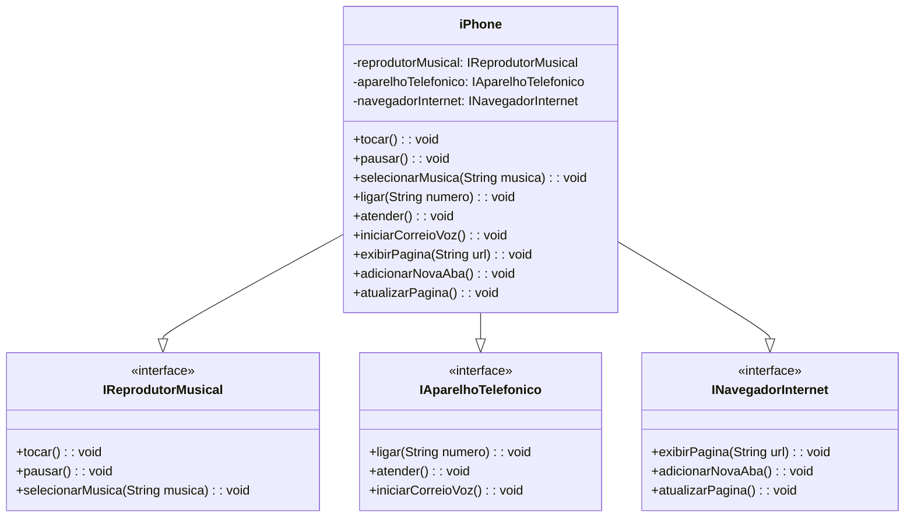

# Modelagem e Diagramação de um Componente iPhone

Este projeto foi desenvolvido como parte de um estudo para o bootcamp da DIO, focado em aprofundar conhecimentos sobre **Programação Orientada a Objetos (POO)**, **UML (Unified Modeling Language)** e implementação em **Java**. O objetivo principal foi modelar as funcionalidades essenciais de um iPhone – Reprodutor Musical, Aparelho Telefônico e Navegador na Internet – utilizando diagramas de classe UML e, em seguida, transpor essa modelagem para código Java.

## Funcionalidades Modeladas

### Reprodutor Musical

  * `tocar()`: Inicia a reprodução de uma música.
  * `pausar()`: Pausa a música em execução.
  * `selecionarMusica(String musica)`: Permite escolher uma música específica para tocar.

### Aparelho Telefônico

  * `ligar(String numero)`: Realiza uma chamada para um número.
  * `atender()`: Aceita uma chamada recebida.
  * `iniciarCorreioVoz()`: Acessa o sistema de correio de voz.

### Navegador na Internet

  * `exibirPagina(String url)`: Carrega e exibe uma página web.
  * `adicionarNovaAba()`: Abre uma nova aba no navegador.
  * `atualizarPagina()`: Recarrega a página atualmente exibida.

-----

## Diagrama de Classes UML

